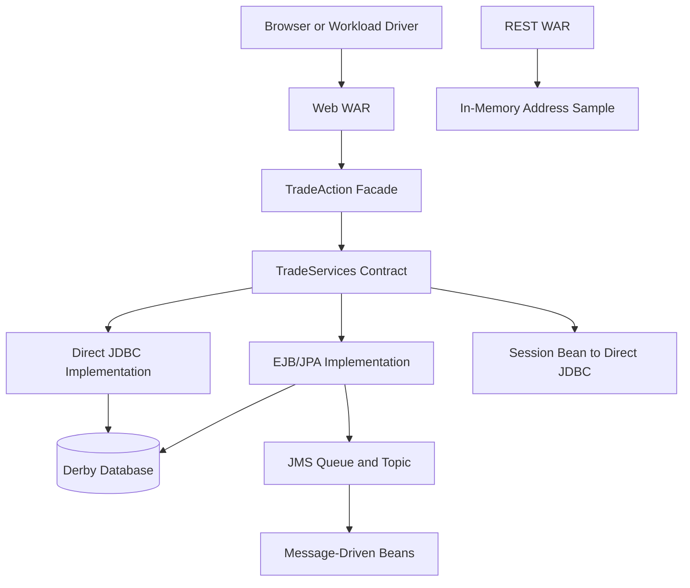
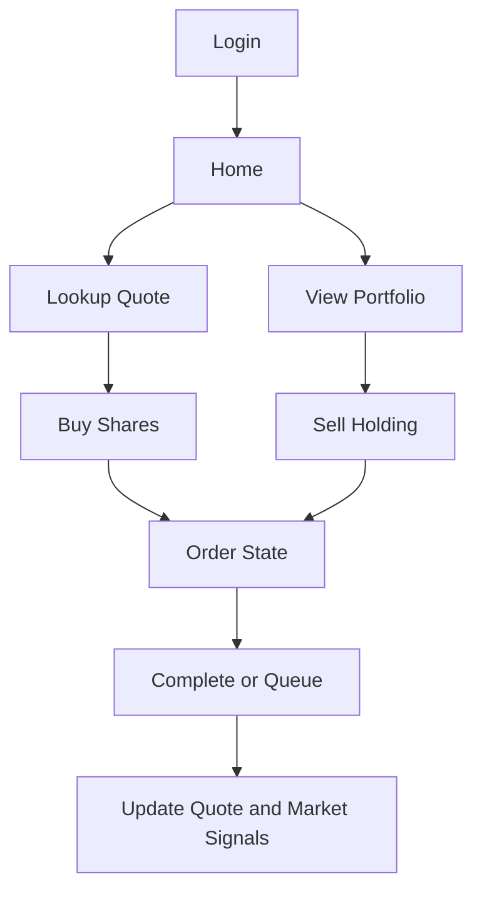
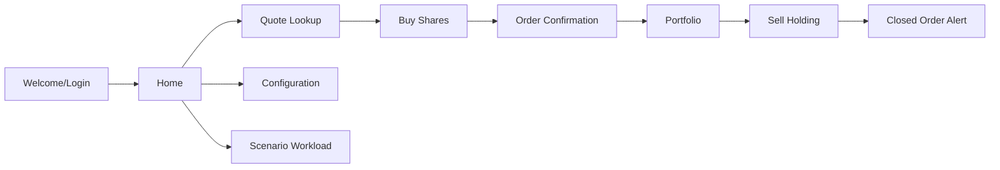

# Chapter 1: Reading DayTrader as an Instrument

DayTrader looks like a stock-trading sample because that is the easiest way to make enterprise middleware do real work. Users log in, read quotes, inspect portfolios, buy and sell holdings, and watch account balances move. Those workflows matter. If you modernize this codebase without preserving them, you have not modernized the system; you have replaced it.

But DayTrader is also something more specific: a measurement instrument. It gives the same trading behavior several execution paths so engineers can compare the cost of EJB, JPA, direct JDBC, JMS, JSP, JSF, REST, and workload generation. That dual identity is the key to reading the code. Some choices that look like design mistakes are really benchmark controls. Others are genuine legacy hazards. The job of this book is to separate the two.

By the end of this chapter, you should see the system as a whole: not a pile of Java EE samples, but a deliberately layered training ground for modernization work.

## The Two Systems in One Codebase

DayTrader has a business system and a benchmark system living in the same EAR.

The business system is the trading app:

- Accounts and profiles model users.
- Quotes model market data.
- Holdings model owned shares.
- Orders model buy and sell requests.
- Servlets and JSPs provide a browser workflow.
- EJB/JPA and direct JDBC implementations mutate the same logical state.

The benchmark system surrounds that:

- Runtime modes switch the implementation behind the same service contract.
- Primitive endpoints isolate specific Java EE layers.
- Scenario and JMeter workloads generate repeatable traffic.
- Runtime configuration changes workload shape without redeploying.
- Liberty resources expose database, messaging, and transaction behavior.



The diagram matters because it prevents a common modernization mistake. The REST WAR is not a new API for the trading domain. It is an adjacent JAX-RS primitive. The trading behavior flows through `TradeServices`, not through `/rest/addresses`.

## The Module Map

The repository is split into five main modules:

| Module | Role |
| --- | --- |
| `daytrader3-ee6-ejb` | Business contract, entities, EJB/JPA implementation, direct JDBC implementation, MDBs, persistence descriptors |
| `daytrader3-ee6-web` | Main UI, servlet controllers, JSPs, JSF primitives, benchmark primitives, configuration UI, DDL resources |
| `daytrader3-ee6-rest` | Small JAX-RS address-book sample used as an edge primitive |
| `daytrader3-ee6` | EAR assembly |
| `daytrader3-ee6-wlpcfg` | Liberty server configuration and runtime resources |

This division is not pure domain-driven design. The web module contains operational DDL. The EJB module contains both domain logic and a direct JDBC shadow implementation. The Liberty config module contains deployable runtime state. These are modernization clues: before changing code, learners should decide whether a file is domain behavior, benchmark scaffolding, deployment wiring, or historical residue.

## Why a Trading Domain?

A trading app is useful because it forces the container to exercise multiple kinds of work:

- Authentication-like session state.
- Read-heavy quote and portfolio pages.
- Write-heavy buy and sell flows.
- Relational relationships between account, order, holding, and quote.
- Transactional balance updates.
- Asynchronous order completion.
- Market-summary aggregation.
- Repeated workload generation.

That makes DayTrader richer than a CRUD sample. It also makes it more dangerous to modernize casually. A buy operation is not just an insert. It creates an order, changes account balance, eventually creates a holding, updates quote volume and price, and can trigger JMS publication.



For AI-assisted modernization training, this is the right scale. The code is small enough to read, but the behavior is interconnected enough to punish shallow transformations.

## DayTrader in One User Journey

Before the architecture becomes abstract, put one user through the app.



Imagine a seeded user logs in from the welcome page. The login updates account counters and stores the user ID in the HTTP session. The home page shows account balance and holdings. The user looks up a generated stock symbol, buys shares, and receives an order confirmation. If the order completes synchronously, a holding appears in the portfolio; if it is queued, a message-driven bean completes it later. The quote’s price and volume move after the trade. When a sell order closes, a later web request can show an alert, and the alert read changes the order from `closed` to `completed`.

That journey is the training spine. Every modernization exercise should be able to answer which part of this journey it changes, how it preserves account/order/holding/quote state, and whether benchmark comparability still holds.

## Benchmark Code Is Not Automatically Bad Code

Modernization learners often see mutable static config, JSP scriptlets, unauthenticated reset endpoints, and direct JDBC beside JPA and immediately label everything as bad. That reaction is understandable, but it is too blunt.

Some parts are bad production patterns:

- Exposed database reset controls.
- Checked-in runtime logs and deployed artifacts.
- Mutable global runtime configuration.
- Weak separation between controller and view.
- Descriptor drift across application servers.

Some parts are benchmark affordances:

- Multiple implementations behind one service contract.
- Primitive endpoints for isolating overhead.
- JSP-side quote fragments for cache and rendering experiments.
- Scenario includes that compress a user journey into one server-side path.
- Direct JDBC reset that escapes the normal JPA path for setup speed.

A modernization effort should preserve the second group until it has replaced the measurement method. Removing benchmark affordances too early destroys the training value of the system.

## The Canonical Path Through the Book

The book follows the order a modernization engineer should use:

1. Understand the stable service contract.
2. Understand the domain model and invariants.
3. Trace read workflows.
4. Trace buy and sell state transitions.
5. Compare EJB/JPA and direct JDBC implementations.
6. Understand async JMS behavior.
7. Understand UI, workload, and primitive surfaces.
8. Understand Liberty deployment resources.
9. Extract modernization and performance patterns.

The next chapter starts with the service contract because that is the system’s load-bearing abstraction. Everything else either implements it, adapts to it, or measures the cost of traveling through it.

## Deep Dive: Modernization Reading Order

When using DayTrader as an AI modernization training ground, give the model a reading order. Do not ask it to “modernize the app” from the root. Start with a narrow behavior and force it to trace all implementations.

For example, a buy-order modernization task should inspect:

- Web action dispatch.
- `TradeAction` runtime selection.
- `TradeServices.buy`.
- EJB/JPA buy path.
- Direct JDBC buy path.
- Order completion path.
- Quote update path.
- JSP order confirmation.
- Workload drivers that exercise buy.

That sequence trains the model to preserve behavior rather than translate syntax.

## Deep Dive: Prompting for Evidence

A weak AI modernization prompt is broad:

```text
Rewrite the JSP app using a modern framework.
```

A useful prompt names the behavior and the cross-implementation obligations:

```text
Trace the buy workflow from /app?action=buy through TradeAction, TradeServices,
the EJB/JPA path, the direct JDBC path, quote update, order confirmation JSP,
and workload drivers. Produce invariants and tests before proposing UI changes.
```

The second prompt forces the model to read the trading system instead of performing a syntax migration.

## Apply This

1. **Dual-Identity Map** -> Separates product behavior from measurement scaffolding -> Label each subsystem before changing it -> Pitfall: deleting benchmark code because it looks unlike production code.
2. **Canonical Flow First** -> Prevents local edits from breaking cross-layer behavior -> Trace one complete user journey before refactoring classes -> Pitfall: modernizing an entity without checking JSP and direct JDBC dependencies.
3. **Stable Contract Lens** -> Reveals why alternate implementations exist -> Identify the interface all execution paths share -> Pitfall: replacing one implementation and silently changing semantics.
4. **Runtime-as-Architecture** -> Treats server config as part of the system design -> Read deployment resources with the code, not after it -> Pitfall: assuming JNDI, transactions, and pools are incidental.
5. **Training-Ground Framing** -> Makes AI modernization tasks precise -> Ask models to preserve domain invariants and benchmark comparability separately -> Pitfall: using broad prompts that flatten all legacy code into “cleanup.”
