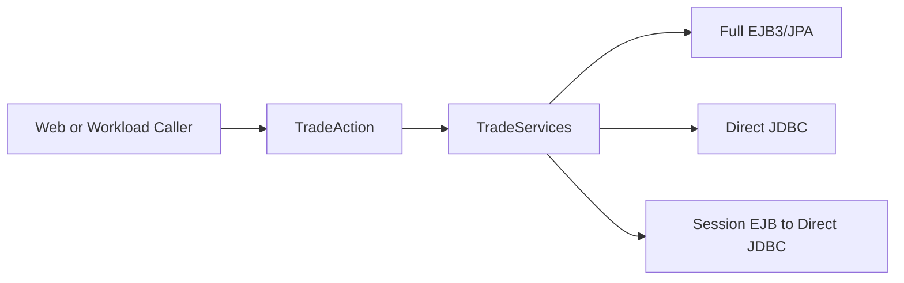
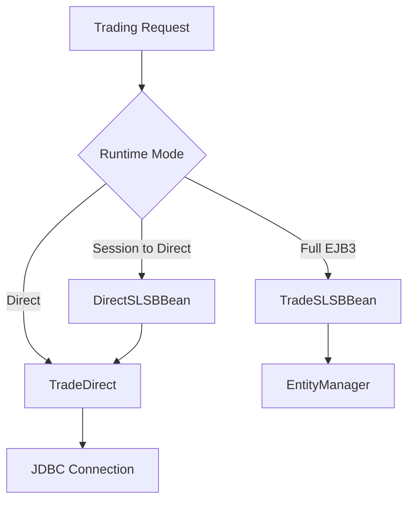

# Chapter 2: The Stable Surface

Chapter 1 framed DayTrader as both a trading app and a measurement instrument. That only works because the system has a stable surface: one business contract that multiple implementations can satisfy. Without that contract, the benchmark would compare unrelated code paths. With it, the same browser action can exercise EJB/JPA, direct JDBC, or EJB-wrapped JDBC.

The contract is not just an interface. It is a modernization boundary. If learners preserve the surface but change internals carefully, they can modernize implementation pieces while keeping user workflows and workload drivers meaningful.

By the end of this chapter, you should understand why `TradeServices`, `TradeAction`, and `TradeConfig` are the control plane for the whole application.

## The Business Contract

`TradeServices` defines the operations the rest of the system treats as trading behavior:

| Area | Representative Operations |
| --- | --- |
| Market | get market summary, get quote, create quote, update quote price and volume |
| Account | register, login, logout, get account data, update profile |
| Portfolio | get holdings, get a holding |
| Orders | buy, sell, queue order, complete order, cancel order, get orders, get closed orders |
| Operations | reset trade |

The important point is not the method list. The important point is that these operations form the comparison surface. The full EJB implementation and direct JDBC implementation are expected to tell the same story about accounts, holdings, quotes, and orders.



If a modernization changes `buy` in only one implementation, it has probably introduced a benchmark regression even if the main UI still works.

## `TradeAction` as Facade and Switchboard

`TradeAction` exists so callers do not need to know which runtime mode is active. It creates or reuses a `TradeServices` delegate based on global configuration. It is also more than routing: it owns the market-summary cache and adds post-trade quote updates around buy and sell calls. Treat it as part of business behavior, not disposable plumbing.

This is the pattern in pseudocode:

```java
service = cachedService

if mode == EJB_MODE and service is not ejbService:
    service = lookupLocalBean("tradeBean")
else if mode == DIRECT_MODE:
    service = new directService()
else if mode == WRAPPED_DIRECT_MODE and service is not wrapperBean:
    service = lookupLocalBean("directWrapper")
```

The pattern is simple and useful: callers depend on behavior, not plumbing. The trade-off is that the cached delegate is static and mutable. Runtime mode changes can affect every request in the JVM, and correctness relies on type checks replacing stale delegates when needed.

For modernization, this is a natural seam, but not a place to improvise. Replacing it with dependency injection would be attractive, but the benchmark still needs runtime switching. The modern version should keep explicit strategy selection even if the mechanism changes.

## Runtime Modes

DayTrader’s main runtime modes are:

| Mode | Meaning | Why It Exists |
| --- | --- | --- |
| Full EJB3 | Stateless session bean plus JPA entities | Measures normal Java EE business/persistence path |
| Direct JDBC | Direct SQL and JMS from the service implementation | Measures lower-level database path without EJB/JPA overhead |
| Session to Direct | Stateless session bean wrapping direct JDBC | Isolates EJB invocation/transaction overhead from JPA overhead |

That third mode is the most instructive. It is not a feature a product team would normally add. It exists because benchmark systems need controlled comparisons.

| Mode or Setting | Implementation Path | Transaction Owner | Measurement Question |
| --- | --- | --- | --- |
| `EJB3` | `TradeSLSBBean` -> JPA `EntityManager` | EJB container | Cost and behavior of normal Java EE business/persistence path |
| `DIRECT` | `TradeDirect` -> JDBC/JMS | Direct code, sometimes `UserTransaction` | Cost and behavior without EJB/JPA |
| `SESSION3` | `DirectSLSBBean` -> `TradeDirect(true)` | EJB container | Cost of EJB boundary without JPA |
| `SYNCH` orders | Caller completes order inline | Current service call | Baseline order completion behavior |
| `ASYNCH_2PHASE` orders | JMS queue -> broker MDB -> service completion | Container/JTA path | Cost and semantics of async completion |



A modernization learner should preserve the three-way comparison until they intentionally replace the benchmark strategy.

Throughout the book, “service contract” means the `TradeServices` behavior surface. “Runtime mode” means the configured implementation strategy behind that surface. “Benchmark primitive” means an endpoint whose primary job is measurement. “Operations endpoint” means reset, database build, or configuration behavior. “Historical descriptor” means retained app-server metadata that is not the Liberty runtime’s main source of truth.

## Configuration as Global Control Plane

`TradeConfig` holds more than configuration. It defines:

- Runtime mode.
- Order processing mode.
- Workload mix.
- Web interface variant.
- Database scale.
- Market summary cache interval.
- Primitive iteration count.
- Long-run behavior.
- Quote update and quote-publish flags.
- Random data generation helpers.
- JSP page mappings.

This is convenient for a benchmark. It is risky for production.

The convenience is that `/config` can reshape the app during a run. The risk is that mutable static state becomes hidden input to nearly every subsystem. If an AI modernization tool misses that, it may write code that looks pure but behaves differently under workload.

## Contract Extension Points

`TradeSLSBLocal` extends the base contract with benchmark-specific operations such as a trivial investment-return call, two-phase ping, and quote publication. The split is instructive:

- `TradeServices` is the business surface.
- Local EJB interfaces add container-specific probes.
- Primitive servlets may bypass `TradeAction` entirely to isolate a layer.

Do not collapse all of this into one “service class” during modernization. The distinction between business operations and measurement probes is valuable.

## Deep Dive: The Static Delegate Hazard

The static `TradeAction` delegate is a compact optimization and a source of subtle behavior.

Benefits:

- Avoids repeated EJB lookup.
- Keeps each web action cheap to construct.
- Centralizes fallback lookup names.

Costs:

- Global mutable service state.
- Runtime mode changes have process-wide effects.
- Thread-safety depends on benign races and type checks.
- Test isolation becomes harder.

A modernized version could use a strategy registry:

```java
strategy = registry.get(currentMode)
return strategy.execute(operation)
```

That keeps runtime mode explicit without tying the entire application to a single static field.

## Apply This

1. **Comparable Contract** -> Enables multiple implementations to be tested fairly -> Define one behavior surface before replacing internals -> Pitfall: letting implementation-specific methods leak into callers.
2. **Runtime Strategy Switch** -> Supports controlled architectural experiments -> Keep strategy selection explicit and observable -> Pitfall: hiding mode selection inside framework magic.
3. **Facade With Discipline** -> Shields UI code from infrastructure detail -> Route user workflows through one facade -> Pitfall: turning the facade into a global mutable dumping ground.
4. **Probe Separation** -> Keeps benchmark endpoints from polluting domain behavior -> Put measurement-only operations outside the core contract -> Pitfall: deleting probes before replacing their diagnostic value.
5. **Config Inventory** -> Reveals hidden behavioral inputs -> Audit static configuration before modernization -> Pitfall: treating config constants as harmless literals.
