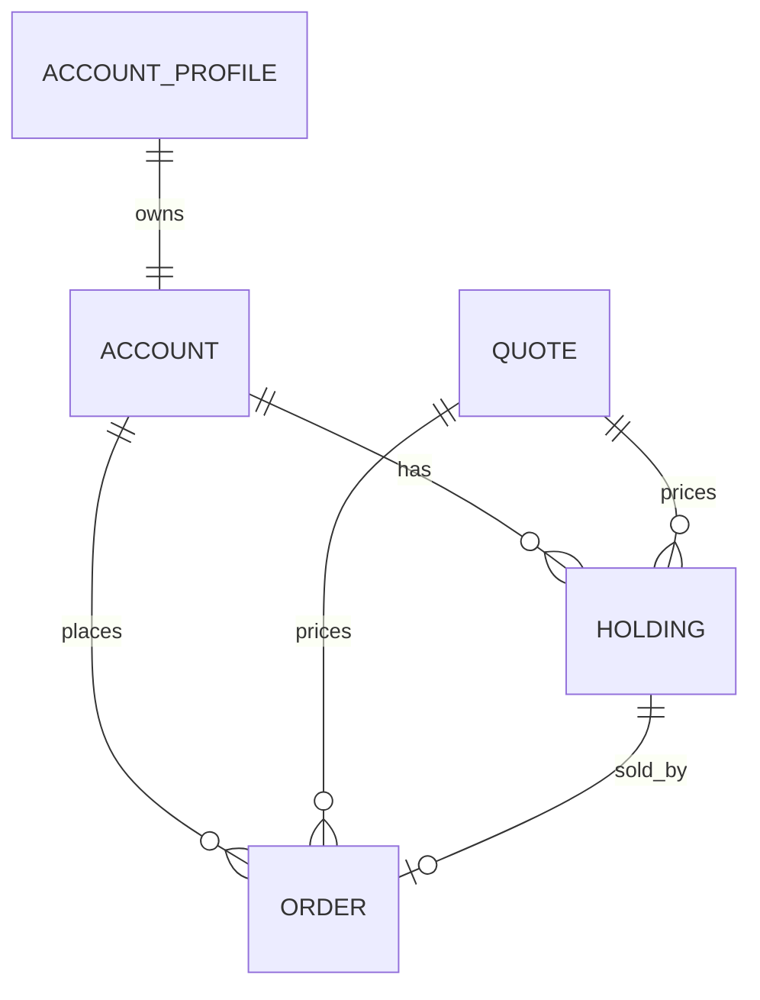

# Chapter 3: Data as the Common Currency

Chapter 2 explained the stable service surface. That surface only works because each implementation speaks the same data language: accounts, profiles, quotes, holdings, orders, and market summaries. These types are the vocabulary of both the trading app and the benchmark.

DayTrader’s data model is not a clean modern domain model. It is a hybrid of JPA entities, display beans, serialization-friendly DTOs, and legacy compatibility decisions. That makes it ideal modernization material: the reader must learn to distinguish business invariants from persistence accidents.

By the end of this chapter, you should know what each data type means, how the relationships fit, and where modernization work can accidentally change behavior.

## The Domain Graph



The trading model is small:

- A profile identifies and authenticates a user.
- An account stores balance and login state.
- A quote stores market data for a symbol.
- A holding stores shares owned by an account.
- An order records a buy or sell request.

The interesting part is how much behavior depends on relationships being navigable after service calls return. JSPs and servlet helpers expect detached-looking objects to have enough data inflated for display. That is why some service methods touch lazy relationships before returning.

## Account and Profile

The profile is keyed by user ID and stores password, name, address, email, and credit card. The account stores balances and login counters. The two are one-to-one.

The login operation is split across layers:

- Service finds the profile.
- Service navigates to the account.
- Entity method checks password and updates login counters.

That puts a small business rule inside the entity. It is not pure anemic DTO code, but it is not a rich domain model either. A modernization should preserve the rule even if password handling is later replaced.

```java
profile = profiles.find(userName)
account = profile.account

if profile.password != submittedPassword:
    rejectLogin()

account.lastLogin = now()
account.loginCount += 1
```

The pattern matters because read-looking operations may mutate state. `login` is not a query.

## Quotes

Quotes hold the market side of the system:

| Field Concept | Meaning |
| --- | --- |
| Symbol | Stable identifier such as a generated stock symbol |
| Company name | Display label |
| Price | Current price |
| Open | Opening price |
| Low/high | Session price bounds |
| Volume | Shares traded |
| Change | Movement from open/current baseline |

Quote updates are central because buy and sell operations update volume and price after order work. The EJB path uses a native `for update` query to serialize mutation. The direct path mirrors this with SQL.

For modernization, quote behavior is a regression hotspot. If a new service updates holdings but forgets volume, the UI may still look functional while benchmark behavior changes.

## Holdings

A holding represents owned shares of one quote in one account. It has quantity, purchase price, and purchase date.

The surprising behavior is the sell-in-flight marker. Instead of a status field, DayTrader sets the holding purchase date to the epoch when a sell order is created. Scenario code later avoids selling holdings with that marker.

```java
if userRequestsSell(holding):
    order = createSellOrder(holding)
    holding.purchaseDate = epochTimestamp()
```

This is not a pattern to copy into new production systems. It is a behavior to preserve until the model is explicitly migrated. A modernization could introduce a status column, but it would need a migration and compatibility plan for existing logic.

## Orders

Orders carry the write workflow. They store type, status, open/completion dates, quantity, price, fee, account, quote, and optional holding.

Important statuses include:

| Status | Meaning |
| --- | --- |
| `open` | Order created |
| `processing` | Intermediate state used by older paths |
| `closed` | Completed but not yet alerted to the user |
| `completed` | User has been alerted |
| `cancelled` | Terminal failure or duplicate sell |
| `alertcompleted` | Legacy status treated as completed |

The status vocabulary is string-based. That is a modernization target, but converting to an enum must be done carefully because JSPs, direct SQL, named queries, and workload expectations all encode the current values.

## Market Summary

Market summary is not an entity. It is a DTO assembled from quote data:

- Trade Stock Index Average.
- Opening index average.
- Total volume.
- Top gainers.
- Top losers.
- Summary timestamp.

The service computes it from a subset of quote symbols and `TradeAction` caches it. This is a cross-cutting object: it is domain-facing, UI-facing, and benchmark-facing because its computation can be intentionally expensive.

## Key Generation

JPA entities use table generation, and direct JDBC uses its own key allocator. Both rely on the same key table concept with block allocation.

```java
block = keyTable.reserve(entityName, blockSize)

while block.hasNext():
    id = block.next()
    persist(record.withId(id))
```

Block allocation reduces database trips during seed and workload operations. It also keeps JPA and JDBC paths comparable because both can generate IDs from the same underlying table.

## Deep Dive: DTOs for Old Integration Surfaces

`MarketSummaryDataBeanWS` exists because older SOAP-style integration wanted arrays instead of collections. `TradeWSServices` mirrors the trading service with remote-exception signatures and array returns.

This matters for modernization because unused-looking adapter types may encode historical integration constraints. Before deletion, verify whether the training goal is to preserve only the web benchmark or also the legacy integration surface.

## Apply This

1. **Domain Vocabulary Table** -> Prevents accidental semantic drift -> Define each persistent type in business terms before refactoring it -> Pitfall: mistaking display beans for harmless DTOs.
2. **Relationship Inflation Audit** -> Finds lazy-loading assumptions -> List which service methods touch relationships before returning -> Pitfall: moving rendering outside a transaction and triggering missing data.
3. **String State Inventory** -> Exposes hidden state machines -> Catalog status literals and query usage before enum conversion -> Pitfall: changing one layer and breaking direct SQL or JSP checks.
4. **Legacy Marker Detection** -> Finds encoded behavior such as epoch timestamps -> Treat odd sentinel values as domain rules until proven otherwise -> Pitfall: replacing them without migration logic.
5. **Shared ID Strategy** -> Keeps implementations comparable -> Preserve key semantics across ORM and SQL paths -> Pitfall: modernizing JPA IDs while direct JDBC still expects the old key table.

