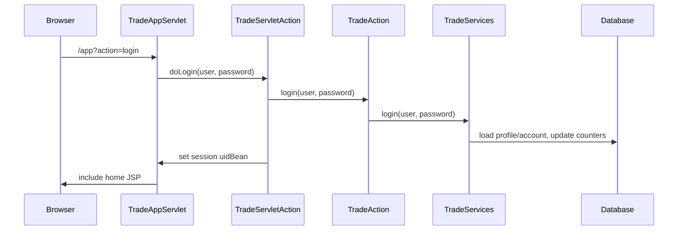
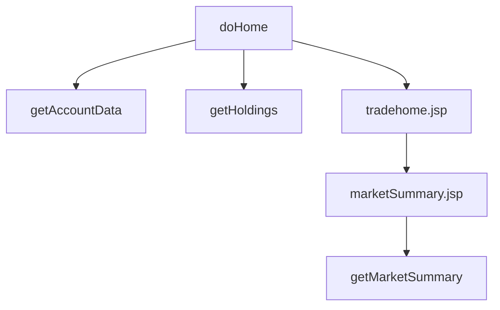

# Chapter 4: Login, Home, Portfolio, and Quote Lookup

Chapter 3 gave the data model. This chapter follows the read-heavy workflows that make those objects visible to users: login, home, portfolio, and quote lookup. These flows are the safest place to start modernization training because they reveal coupling without immediately forcing the hardest transaction decisions.

They are still not trivial. Login mutates account state. Home renders holdings and market summary through different paths. Portfolio enriches holdings with quotes. Quote lookup deliberately bypasses the normal controller in JSP fragments. The application is teaching an important legacy lesson: “read path” does not mean “side-effect free.”

By the end of this chapter, you should be able to trace a browser request from `/app` through session state, service calls, JPA/direct JDBC, and JSP rendering.

## Login as a Mutating Read

The browser submits a user ID and password to `/app?action=login`. The servlet reads parameters, hands them to `TradeServletAction`, and that helper calls `TradeAction.login`.



The session key `uidBean` is the application’s authentication flag. There is no container-managed login. For modernization, that means security behavior lives in servlet code and JSP navigation, not in deployment descriptors.

The login service updates `lastLogin` and increments a counter. A rewritten authentication layer must either preserve that side effect or intentionally retire it with a test update.

## Home Page Assembly

The home page shows account data, holdings, and market summary. The controller fetches account and holdings. The market summary is fetched inside a JSP fragment.

That split is deliberate. Moving market summary into a JSP fragment makes it independently cacheable and measurable. In a clean MVC application it would be suspicious. In DayTrader, it is part of the benchmark design.



Modernization learners should not automatically “fix” this by moving all service calls into the servlet. First decide whether the modernized system must preserve fragment-level cache behavior.

## Portfolio Enrichment

Portfolio display is a two-step read:

1. Load holdings for a user.
2. Load the current quote for each holding.

The holding already has a quote relationship, but the web action still performs quote lookups. That gives the JSP a paired collection of holdings and quote data. It is not elegant, but it is part of the display contract.

The service also touches related objects before returning to avoid lazy-loading problems in the JSP.

```java
holdings = service.getHoldings(user)
quotes = []

for each holding in holdings:
    quotes.add(service.getQuote(holding.symbol))

request.holdings = holdings
request.quotes = quotes
render("portfolio")
```

In modernization, this is a good candidate for a view model. But the view model should be introduced after tests lock down the existing output and quote lookup behavior.

## Quote Lookup and JSP Fragments

Quote lookup is intentionally odd. `TradeServletAction.doQuotes` dispatches to the quote page without doing all quote work itself. The JSP tokenizes symbols and includes a display fragment for each symbol. That fragment creates `TradeAction` and calls `getQuote`.

Why? Because quote display is a useful fragment for edge caching and measurement.

The trade-off is heavy coupling:

- JSP knows service facade.
- JSP parses request data.
- JSP controls repeated service calls.
- Controller looks incomplete unless you know the benchmark rationale.

For AI-assisted modernization, this is exactly the kind of code that needs instruction. A broad “convert JSP scriptlets to templates” prompt may accidentally collapse fragment behavior and lose the benchmark dimension.

## Invalid Symbols

Invalid symbol handling returns a quote-like object with an invalid-symbol label and zero-valued market data. It does not simply throw.

This design keeps the quote page renderable when input is bad. A modernization that turns invalid symbols into HTTP errors would change user behavior and possibly benchmark assertions.

## Deep Dive: Session State and Scenario Workloads

The scenario servlet depends on the same session state as a browser:

- If `uidBean` is absent, it forces login.
- Logout invalidates the session.
- Registration may request session recreation.
- Sell flows include portfolio first so they can read holdings from request attributes.

This means scenario traffic is not just random service calls. It is a compressed version of the web workflow. Modernizing the web layer without preserving session and request-attribute contracts can break the workload generator even if the visible UI still works.

## Apply This

1. **Mutating Query Check** -> Finds reads that update state -> Inspect login and alert paths before labeling them queries -> Pitfall: making them cacheable without preserving side effects.
2. **Fragment Rationale Test** -> Separates bad MVC from intentional benchmark design -> Ask why a JSP calls a service before moving it -> Pitfall: removing cache/measurement boundaries.
3. **View Contract Capture** -> Makes JSP expectations explicit -> Record request attributes and object shapes per page -> Pitfall: introducing DTOs that omit transient fields.
4. **Session Key Map** -> Protects app-level auth behavior -> Document session attributes and lifecycle transitions -> Pitfall: replacing login without scenario compatibility.
5. **Invalid Input Semantics** -> Preserves user-visible behavior -> Treat placeholder domain objects as behavior, not clutter -> Pitfall: replacing them with exceptions that alter UI and tests.

