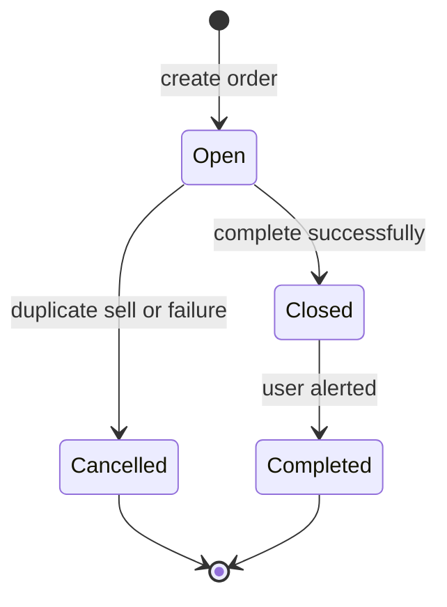
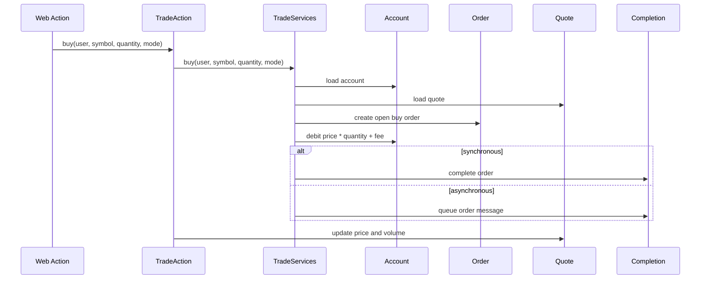
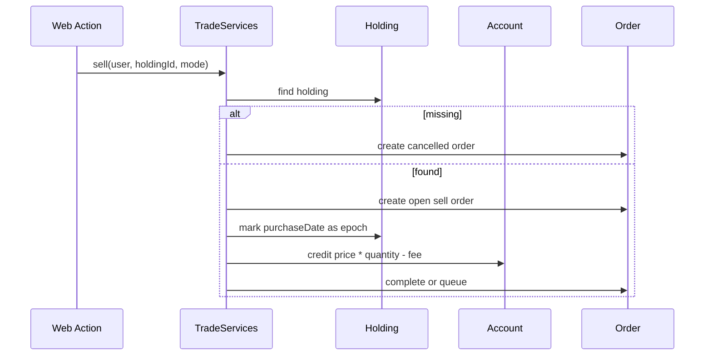

# Chapter 5: Buy and Sell as Order State Machines

Chapter 4 traced read-heavy workflows. Buy and sell are different: they are the core trading mutations. They touch account balance, orders, holdings, quotes, synchronous completion, asynchronous queues, and user alerts. If a modernization learner understands only one part of DayTrader deeply, it should be this chapter.

The central lesson is that a trade is not one database write. It is a small state machine distributed across services, entities, JMS, and JSP feedback. The code does not present it as a state machine; the book does because that is the only safe way to modernize it.

By the end of this chapter, you should be able to explain exactly what DayTrader changes when a user buys or sells stock.

## Order States



The names are deceptively ordinary. `closed` does not mean “done forever.” It means “completed but still needs user alert.” `getClosedOrders` reads those orders and mutates them to `completed`. That makes alert retrieval a state transition.

For modernization, the safest first step is to write the state machine down before changing any persistence code.

## Buy Flow

The buy path creates an order before it creates a holding. The holding appears only during completion.



The account is debited when the order is created, not when completion creates the holding. The comments suggest a different ideal, but the implementation is what modernization must preserve.

Pseudocode for the domain behavior:

```java
quote = quotes.find(symbol)
account = accounts.forUser(user)
order = orders.openBuy(account, quote, quantity, quote.price, fee)

account.balance -= quote.price * quantity + fee

if mode == synchronous:
    complete(order)
else:
    enqueue(order)
```

The key invariant is that user buying power changes immediately when the order is accepted.

## Behavioral Invariants

These invariants are the contract modernization must preserve before changing frameworks:

| Behavior | Invariant |
| --- | --- |
| Login | Successful login updates last-login time and login count |
| Invalid quote | Bad symbol renders an invalid-symbol quote object, not a hard failure |
| Buy | Account balance is debited when the buy order is accepted |
| Buy completion | A holding is created only when the buy order completes |
| Sell | Account balance is credited when the sell order is accepted |
| Sell in flight | Holding purchase date is set to epoch until completion removes the holding |
| Closed alert | Reading closed orders changes them to completed |
| Quote movement | `TradeAction` updates quote price and volume after buy/sell service calls |
| Async order | JMS message contains the order ID; database remains source of truth |

## Sell Flow

Sell starts from an existing holding. If the holding is missing, DayTrader returns a cancelled order-like object rather than failing the whole page.



The epoch timestamp marker is one of the system’s most important modernization traps. It encodes “this holding is already being sold” without a status column.

## Completion

Completion interprets order type:

- Buy completion creates a holding and attaches it to the order.
- Sell completion removes the holding and clears it from the order.
- Completion sets status to `closed` and stores a completion date.
- Later alert retrieval changes `closed` to `completed`.

The synchronous path calls completion directly. The asynchronous path sends a JMS message and lets an MDB call completion later.

```java
order = orders.find(id)

if order.isTerminal():
    rejectDuplicateCompletion()

if order.type == BUY:
    holding = holdings.create(order.account, order.quote, order.quantity, order.price)
    order.holding = holding
else:
    holdings.remove(order.holding)
    order.holding = null

order.status = CLOSED
order.completedAt = now()
```

The implementation has a null-check hazard in completion: it dereferences the order before the intended missing-order check. That is not a pattern; it is a defect worth preserving in the analysis and fixing only with a regression test.

## Quote Update After the Trade

After buy or sell returns, `TradeAction` updates quote price and volume. This means the facade adds behavior around the implementation call. Modernization that moves all logic into `TradeSLSBBean` or `TradeDirect` must account for this wrapper behavior.

The ordering is significant:

1. Service creates/completes/queues order.
2. Facade updates quote.
3. Quote update may publish a JMS topic event.

That makes `TradeAction` more than plumbing. It owns part of the trading side effect.

## Closed Orders and User Alerts

`OrdersAlertFilter` checks for closed orders before most `/app` requests. If found, it attaches them as a request attribute so JSPs can render alerts. The read call then marks those orders completed.

This is a legacy-friendly design because no separate notification subsystem is needed. It is also a hidden write in a filter path. A modernized application might replace it with explicit notification state, but the current behavior should be tested first.

## Apply This

1. **State Machine Extraction** -> Makes scattered status changes visible -> Draw states before editing persistence code -> Pitfall: converting status strings without preserving transitions.
2. **Immediate Balance Rule** -> Captures the accepted-order invariant -> Test account balance after order creation, not only completion -> Pitfall: moving balance changes to completion and changing async semantics.
3. **Sentinel Migration Plan** -> Handles epoch timestamp markers safely -> Introduce explicit status only with compatibility reads/writes -> Pitfall: treating sentinel values as dirty data.
4. **Facade Side-Effect Audit** -> Finds logic outside implementations -> Check wrapper methods before moving business rules -> Pitfall: bypassing `TradeAction` and losing quote updates.
5. **Read-Writes-Too Pattern** -> Exposes alert and login mutations -> Mark filter/query paths that change state -> Pitfall: caching or parallelizing them as pure reads.
