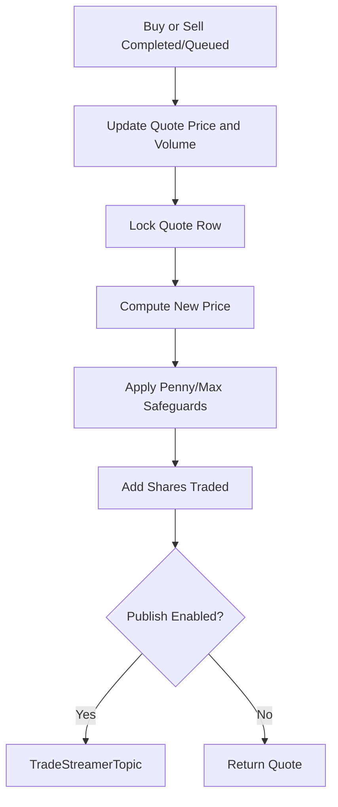
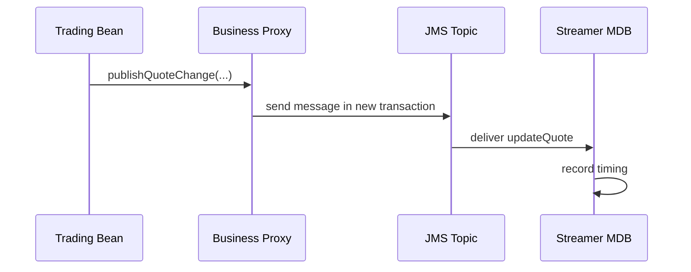
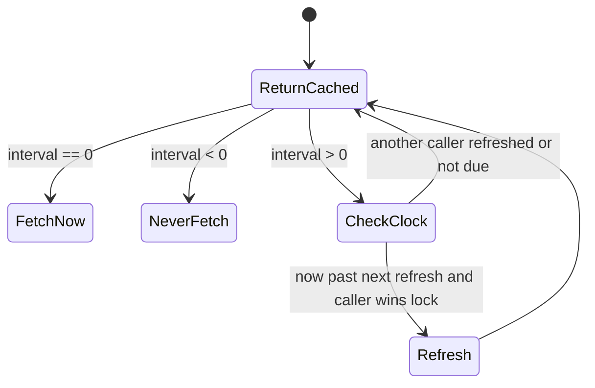

# Chapter 6: Market Movement and Summary Caching

Chapter 5 explained the order state machine. Once orders exist, DayTrader moves the market. Every buy or sell can update quote price and volume, and the home page can compute a market summary from quote data. This chapter covers the market side of the trading app.

The market subsystem has two jobs. First, it creates realistic write pressure around quote rows. Second, it creates an expensive read path worth caching. Both jobs support the benchmark thesis, but both also affect visible trading behavior.

By the end of this chapter, you should understand quote mutation, quote publication, and market-summary caching well enough to modernize them without flattening their performance role.

## Quote Price and Volume Update

After a buy or sell, DayTrader updates the quote for the traded symbol. The update changes current price and volume, then may publish a quote-change message.



The EJB implementation uses a native query with pessimistic locking. That matters because quote rows are hot under benchmark load. A modern implementation that removes locking may look faster until concurrent updates lose volume or price changes.

## Price Safeguards

The code includes two domain-ish safeguards:

- Penny-stock recovery: if a price falls to the minimum, a recovery multiplier can jump it back into a useful range.
- Maximum-price handling: high prices are constrained to avoid database precision overflow.

These are not realistic market rules. They are benchmark survival rules. They keep generated workloads from producing mathematically boring or database-breaking quote values.

```java
lockedQuote = quoteStore.lock(symbol)
oldPrice = lockedQuote.price

factor = randomMovement()
if oldPrice == minimumPrice:
    factor = recoveryFactor

newPrice = clamp(oldPrice * factor)
lockedQuote.price = newPrice
lockedQuote.volume += shares
```

Modernization learners should preserve the workload-stability purpose even if they replace the exact constants or math.

## Quote Publication

Quote publication sends a JMS topic message with old and new market data. The consumer does not push updates to users; it records timing and logs activity. This is instrumentation, not a live market-data feature.

The EJB path publishes through a business proxy to honor a new transaction boundary. That is a subtle Java EE detail: a direct method call inside the same bean would bypass the interceptor that applies transaction metadata.



If a modernization moves this into plain method calls, it must decide whether the separate transaction still matters.

## Market Summary

Market summary computes:

- Average current index.
- Average opening index.
- Total volume.
- Top gainers.
- Top losers.

The EJB path queries quotes ordered by change and computes values in memory. The direct JDBC path uses SQL aggregate queries and separate top-gainer/top-loser reads. The intent is aligned, but the implementations are not identical.

That difference is a modernization warning. When two implementations are meant to be comparable but not textually identical, tests must assert behavior, not code shape.

## Time-Window Cache

`TradeAction` caches market summary because it is expensive.



The cache has three modes:

| Interval | Meaning |
| --- | --- |
| `0` | Fetch every time |
| `<0` | Never fetch; return cached/default summary |
| `>0` | Refresh at most once per interval |

The synchronized refresh pattern is practical: one request performs the expensive work while others keep receiving the old summary.

## Apply This

1. **Hot Row Locking** -> Protects concurrent aggregate state -> Keep quote update serialization explicit -> Pitfall: removing locks because single-user tests pass.
2. **Workload Survival Rules** -> Keeps generated data useful -> Preserve bounds and recovery behavior during modernization -> Pitfall: replacing synthetic rules with “realistic” rules that break benchmark runs.
3. **Instrumentation Event Split** -> Separates core state from measurement messages -> Label topic consumers as observability unless they affect domain state -> Pitfall: building product features on instrumentation assumptions.
4. **Behavioral Equivalence Tests** -> Handles parallel implementations safely -> Compare outputs across EJB and JDBC paths -> Pitfall: assuming mirrored code means mirrored behavior.
5. **Time-Window Cache** -> Reduces expensive aggregate pressure -> Refresh under a narrow lock and serve stale data intentionally -> Pitfall: making all callers wait for fresh summaries.

