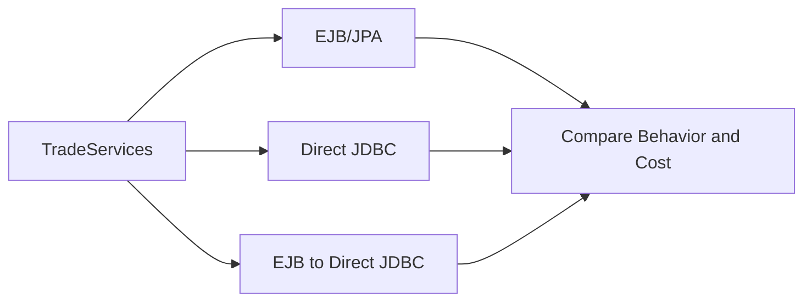
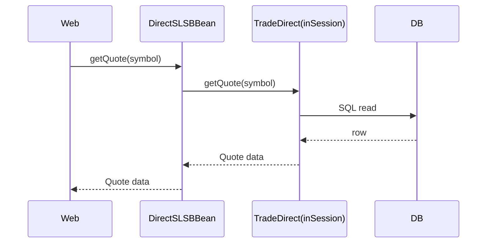

# Chapter 8: The Direct JDBC Shadow System

Chapter 7 described the canonical EJB/JPA path. DayTrader also carries a shadow implementation: direct JDBC and JMS behind the same `TradeServices` contract. It is not a second product architecture. It is a benchmark tool for asking what the container and ORM cost.

For modernization learners, the direct path is invaluable. It exposes the database shape without JPA indirection, but it also doubles the behavior surface. Any change to business semantics must be checked in both paths.

By the end of this chapter, you should understand why `TradeDirect` exists, how it participates in transactions, and why `DirectSLSBBean` wraps it.

## Why Direct JDBC Exists

The direct implementation answers a performance question: what happens if the app does the same trading work with SQL and manual connection control instead of JPA entities inside a stateless bean?



The same contract keeps the comparison meaningful. If the direct path had different business behavior, benchmark results would mix implementation cost with feature differences.

## Connection Lifecycle

`TradeDirect` caches datasource and JMS lookup results statically. Each service call obtains a connection, does work, commits or rolls back, then releases the connection unless it is participating in a container-managed wrapper path.

```java
connection = datasource.getConnection()
connection.autoCommit = false

try:
    result = performSqlWork(connection)
    if not insideContainerTransaction:
        connection.commit()
finally:
    connection.close()
```

The `insideContainerTransaction` flag is what lets `DirectSLSBBean` reuse direct JDBC under EJB transaction control.

There are three transaction cases:

| Case | Entry Point | Commit/Rollback Owner |
| --- | --- | --- |
| Standalone direct | `TradeAction` selects `DIRECT` and calls `TradeDirect` | `TradeDirect` commits or rolls back its JDBC connection |
| EJB-wrapped direct | `TradeAction` selects `SESSION3`, calls `DirectSLSBBean`, which creates `TradeDirect(true)` | EJB container owns transaction; direct commits are suppressed |
| Direct async two-phase | `TradeDirect` begins a `UserTransaction` before DB work and JMS queueing | Direct code coordinates through `UserTransaction` |

This distinction is central. The same SQL implementation can behave incorrectly if modernization loses track of who owns the transaction.

## The Session-to-Direct Mode

`DirectSLSBBean` creates a new direct implementation with an in-session flag for each call. That gives the benchmark a third path:

- EJB invocation and transaction boundary are present.
- JPA entity manager is absent.
- SQL implementation does the data access.

This isolates EJB overhead from JPA overhead better than a simple EJB-vs-JDBC comparison.



## SQL Mirroring

The direct path mirrors the JPA path table by table:

- Profile and account SQL for login.
- Quote SQL for quote lookup and update.
- Holding SQL for portfolio and sell.
- Order SQL for buy/sell/closed orders.
- Key table SQL for identifier allocation.

The mirror is not perfect. Market summary is implemented differently. Some comments and paths drift. That is normal in parallel implementations and exactly why modernization needs behavioral tests.

## Direct Async and Global Transactions

In direct async mode, `TradeDirect` may begin a `UserTransaction`, create the order, debit or credit the account, and queue a JMS message as one coordinated unit. The message includes a property telling the broker MDB to complete through direct JDBC rather than the EJB path.

This is one of the most useful modernization teaching points: asynchronous architecture is not just “send a message.” It is resource coordination plus recovery semantics.

## Reset Uses Direct JDBC

Even in EJB mode, reset delegates to the direct implementation outside the normal transaction. That is not an accident. Reset is an operational bootstrap path, not a user workflow. It drops/recreates data and repopulates through generated quotes/users/holdings.

Modern systems often split this into migrations, seeders, and admin tools. DayTrader compresses it into the app for benchmark convenience.

## Apply This

1. **Shadow Implementation** -> Measures framework cost against equivalent behavior -> Keep a low-level path for controlled comparison -> Pitfall: letting business semantics drift between paths.
2. **Container-Participation Flag** -> Lets the same code run inside or outside managed transactions -> Make transaction ownership explicit -> Pitfall: double-committing inside a container transaction.
3. **SQL Mirror Tests** -> Protect behavior across ORM and direct access -> Assert outputs for both implementations -> Pitfall: testing only the default runtime mode.
4. **Operational Escape Path** -> Separates destructive setup from user transactions -> Keep reset/migration code out of normal domain services -> Pitfall: exposing it without security or environment controls.
5. **Async Resource Coordination** -> Treats messaging as transactional behavior -> Test DB and message outcomes together -> Pitfall: modernizing queue sends as fire-and-forget side effects.
