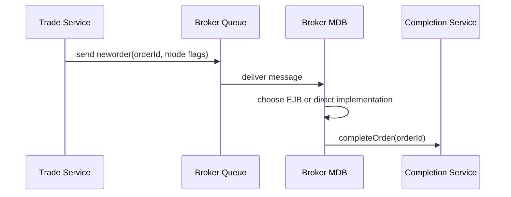

# Chapter 9: Asynchronous Work with JMS and MDBs

Chapter 8 showed the direct JDBC path. Both the EJB and direct paths can hand order completion to JMS. This chapter follows that asynchronous boundary: how an order becomes a message, how the broker MDB decides which implementation to call, and why quote streaming is instrumentation rather than product behavior.

Asynchrony is where modernization projects often lose semantics. The visible UI may still show an order, but transaction timing, redelivery, duplicate handling, and notification state can change.

By the end, you should understand DayTrader’s async order model and its limits.

## Order Queueing

When order processing mode is asynchronous, buy or sell creates an order and sends a JMS text message to the broker queue.

Message properties carry the routing contract:

| Property | Meaning |
| --- | --- |
| `command` | Usually `neworder` |
| `orderID` | Persistent order identifier |
| `twoPhase` | Whether completion should participate in coordinated transaction behavior |
| `direct` | Whether MDB should complete through direct JDBC |
| `publishTime` | Timing stat input |



The message is small because the database remains the source of truth. The message tells the worker which order to complete.

## Broker MDB

The broker MDB consumes queue messages and handles two commands:

- `neworder`: complete an order and record timing.
- `ping`: record timing only.

It checks a `direct` property to decide whether to use the injected EJB service or instantiate the direct implementation.

```java
if message.command == NEW_ORDER:
    service = message.direct ? newDirectService() : injectedTradingBean
    service.completeOrder(message.orderId, message.twoPhase)
else if message.command == PING:
    stats.recordLatency(message.publishTime)
```

That routing keeps async behavior comparable across runtime modes.

## Redelivery and Rollback

The broker MDB ignores redelivered messages. The comment assumes redelivery means rollback/cancellation, but the cancellation path is commented out. This is a fragile recovery story.

For a benchmark sample, it avoids redelivery loops and noisy duplicate processing. For a production trading app, this would be unacceptable without an explicit idempotency and dead-letter strategy.

Modernization learners should not blindly copy the rule. They should preserve it only if preserving benchmark behavior is the goal.

## Quote Streaming

Quote streaming uses a topic. When quote price/volume changes and publication is enabled, the service publishes a message with quote fields. The streamer MDB consumes it and records timing.

It does not:

- Update a read model.
- Push events to browsers.
- Maintain a market feed.
- Affect order completion.

It is instrumentation and stack coverage.


This distinction matters for modernization. If learners see a topic named “streamer,” they may overbuild a real-time feature. The current code does not contain that feature.

## Two-Phase Ping

The primitive two-phase path combines a database read and JMS send inside an EJB transaction. It exists to exercise transaction coordination. It is not part of the trading UI.

This is a recurring DayTrader pattern: some methods exist to measure the platform, not to implement the brokerage.

## Apply This

1. **Message Minimalism** -> Keeps async state in the database -> Send identifiers and routing flags, not full mutable records -> Pitfall: duplicating state and creating reconciliation problems.
2. **Async Mode Parity** -> Preserves implementation comparability -> Include runtime path flags when workers serve multiple strategies -> Pitfall: routing all async work through only the default implementation.
3. **Recovery Semantics Review** -> Separates benchmark shortcuts from production behavior -> Document redelivery, rollback, and duplicate policy -> Pitfall: shipping ignore-redelivery logic as business correctness.
4. **Instrumentation Topic Label** -> Prevents false product assumptions -> Mark topics as measurement or domain events -> Pitfall: building modernization plans around nonexistent consumers.
5. **Transaction Probe Isolation** -> Keeps platform tests out of core workflows -> Put XA/two-phase probes behind primitive endpoints -> Pitfall: confusing benchmark pings with user requirements.

