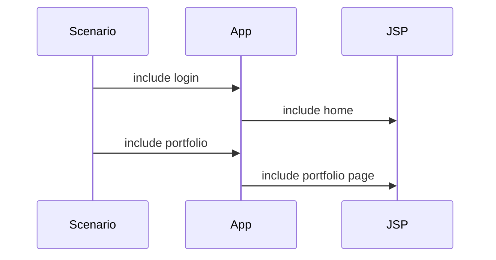

# Chapter 10: The Servlet/JSP Application Shell

Chapter 9 finished the asynchronous backend. Now we return to the browser. DayTrader’s primary UI is a servlet/JSP application, not JSF and not REST. This shell is old, scriptlet-heavy, table-based, and tightly coupled to service objects. It is also where the trading app becomes visible to users.

Modernization learners must respect the UI as more than legacy markup. It encodes request attributes, form names, action names, session behavior, alert display, and benchmark fragment boundaries.

By the end, you should understand the application shell well enough to replace it gradually without breaking the trading loop.

## Front Controller

`TradeAppServlet` maps `/app` and dispatches on the `action` request parameter.

```mermaid
flowchart TD
    App[/app] --> Action{action parameter}
    Action --> Login[login]
    Action --> Register[register]
    Action --> Home[home]
    Action --> Account[account]
    Action --> Portfolio[portfolio]
    Action --> Quotes[quotes]
    Action --> Buy[buy]
    Action --> Sell[sell]
    Action --> Logout[logout]
```

Unauthenticated users can reach welcome, login, and register. Other actions require `uidBean` in the session.

The servlet itself is thin. It parses parameters and calls `TradeServletAction`, which performs service calls and includes JSPs.

## Action Helper

`TradeServletAction` is a procedural controller helper. Each method performs one user action:

- Load service data.
- Populate request attributes.
- Include a JSP selected by `TradeConfig`.
- Convert expected user errors into normal pages.
- Throw unexpected errors as servlet exceptions.

This is not a command pattern. It is a hand-written action table.

```java
if action == BUY:
    order = trading.buy(user, symbol, quantity, configuredMode)
    request.order = order
    include(orderPage)
```

The upside is directness. The downside is that behavior is spread across servlet parsing, helper methods, JSPs, and filters.

## Request Attributes as View Contract

JSPs depend on names such as:

| Attribute | Used For |
| --- | --- |
| `accountData` | Account summary and balance |
| `accountProfileData` | Profile display/update |
| `holdingDataBeans` | Home and portfolio holdings |
| `quoteDataBeans` | Portfolio quote enrichment |
| `orderData` | Order confirmation |
| `orderDataBeans` | Account order history |
| `closedOrders` | Alerts |
| `results` | Page status messages |

A modernization should write these down as a compatibility contract. Replacing JSPs with a new frontend is much easier when the existing view model is explicit.

## Includes Instead of Forwards

DayTrader uses includes heavily. Includes allow one request to compose multiple fragments and allow the scenario servlet to chain several app actions into one response.



This is a benchmark convenience, not a general recommendation. Replacing includes with redirects or forwards can break scenario behavior.

## Configuration UI

`/config` can:

- Display current runtime settings.
- Update runtime mode, workload mix, web interface, summary interval, primitive iterations, and trace flags.
- Reset run stats.
- Recreate database tables.
- Populate the database.

There is no descriptor security around it. That is acceptable only in the context of a local benchmark sample. A production modernization would isolate this behind admin authentication or remove it from the deployed app.

## Alert Filter

`OrdersAlertFilter` calls `getClosedOrders` before most `/app` requests. If orders exist, it stores them in `closedOrders`. JSPs render alert sections.

The filter is part of the order state machine. The service call it uses is not a pure read: `getClosedOrders` finds orders in `closed` state and changes them to `completed` after preparing them for display. Removing the filter changes how orders move from `closed` to `completed`.

## Apply This

1. **Action Parameter Table** -> Makes legacy routing explicit -> Document every action value and required parameters -> Pitfall: replacing routing and missing odd names with spaces.
2. **Request Attribute Contract** -> Enables safe UI replacement -> Treat JSP attribute names as API until migrated -> Pitfall: changing names before all views/workloads are updated.
3. **Include Semantics Preservation** -> Protects scenario chaining and fragments -> Identify include-dependent flows before replacing rendering -> Pitfall: converting includes to redirects globally.
4. **Admin Surface Isolation** -> Separates benchmark operations from user app -> Secure or externalize reset/config flows in production modernization -> Pitfall: leaving destructive endpoints exposed.
5. **Filter Side-Effect Awareness** -> Preserves hidden state transitions -> Audit filters for service calls and mutations -> Pitfall: removing filters as “just display concerns.”
