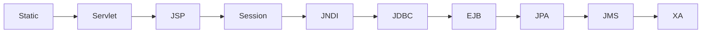

# Chapter 11: Scenario Traffic and Primitive Endpoints

Chapter 10 described the human-facing web shell. DayTrader also needs non-human users: workload generators and primitive endpoints that exercise the stack predictably. This chapter explains those surfaces.

The primitive subsystem is the clearest evidence that DayTrader is a measurement instrument. It decomposes Java EE into small probes so engineers can estimate the marginal cost of each layer.

By the end, you should understand how the benchmark drives traffic and how to avoid mistaking primitives for product features.

## Scenario Servlet

`TradeScenarioServlet` generates a user journey inside the server. It chooses an action from `TradeConfig` workload mix, ensures a user is logged in, and includes `/app?action=...`.

```mermaid
flowchart TD
    Scenario[/scenario] --> HasUser{uidBean?}
    HasUser -->|No| Login[include login]
    HasUser -->|Yes| Pick[Pick workload action]
    Pick --> Include[include /app action]
    Include --> Response[Combined HTML response]
```

The scenario servlet is convenient because a load generator can hit one URL. It is less realistic than browser-like traffic because multiple actions can be server-side includes inside one HTTP response.

## Primitive Matrix

Primitive endpoints isolate layers:

| Surface | Examples |
| --- | --- |
| Web WAR static/servlet/JSP | HTML, simple servlet, writer servlet, PDF streaming, include, forward, JSP, JSP EL |
| Web WAR session/data primitives | session create/read, mutate/invalidate, large session payload, JNDI lookup, JDBC read/write |
| EJB/JPA/JMS primitives | session bean ping, entity lookup, relationship collections, queue send, topic publish, two-phase ping |
| JSF Facelets in web WAR | small quote Facelet, large account/holding Facelet |
| REST WAR sample | JAX-RS address list and search endpoints, not trading behavior |

The goal is differential measurement. Static HTML is the baseline. A simple servlet adds servlet dispatch. JSP adds compilation/runtime and expression handling. JDBC adds datasource and SQL. EJB/JPA adds container and persistence context. JMS adds messaging.



This is not a strict call chain. It is a measurement ladder.

## Primitive Iteration

Primitive iteration repeats lower-layer work inside one request. That reduces the proportion of HTTP/web overhead in a measurement.

```java
for i in 1..configuredIterations:
    performMeasuredOperation()
renderTimingPage()
```

This is a simple but transferable benchmarking idea: if the thing you want to measure is too small, repeat it under controlled conditions.

## JMeter Workload

The JMeter plan is more realistic than the scenario servlet. It drives `/daytrader/app` with cookies, keepalive, think time, assertions, and extraction of holdings for sell operations. It also includes JSF and REST requests.

For modernization training, keep JMeter in the loop. It catches end-to-end behavior that primitive pings cannot.

## Primitive Hazards

Some primitive code is intentionally rough:

- Static counters are unsynchronized.
- Some labels are stale.
- Some endpoints are not safe production examples.
- JMS primitive comments warn against treating them as performance tests.

That is fine if you read them as probes. It is dangerous if you copy them as architecture.

## Apply This

1. **Differential Probe Ladder** -> Estimates marginal framework cost -> Build small adjacent endpoints for comparison -> Pitfall: comparing endpoints with different business work.
2. **Scenario-vs-Realism Split** -> Balances convenience and fidelity -> Use server-side scenarios for smoke/load shape and client scripts for realism -> Pitfall: treating include-heavy scenario throughput as browser throughput.
3. **Iteration Amplifier** -> Makes small costs measurable -> Repeat target work inside one request carefully -> Pitfall: hiding contention or resource leaks.
4. **Primitive Labeling** -> Prevents probe code from becoming product code -> Mark endpoints as benchmark-only in modernization plans -> Pitfall: exposing pings and reset controls in production.
5. **Workload Regression Harness** -> Protects user journeys during modernization -> Keep JMeter or equivalent scripts active -> Pitfall: relying only on unit tests for legacy web flows.
