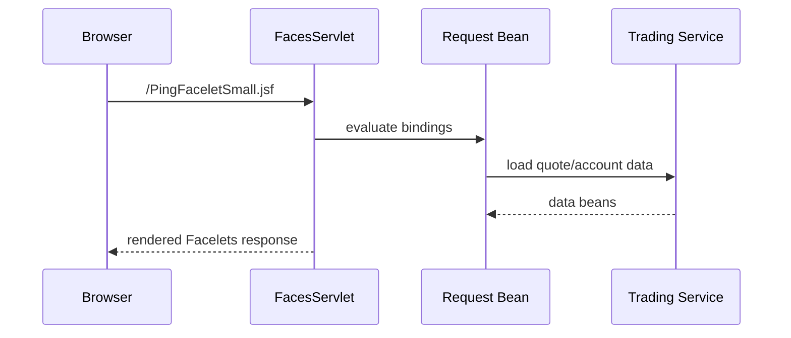

# Chapter 12: JSF at the Edge of the Benchmark

Chapter 11 covered workload primitives. The book is now leaving the main trading loop and cataloging benchmark-adjacent web/API surfaces. JSF is one of those surfaces, not the primary application framework. DayTrader’s trading UI is servlet/JSP. JSF exists to put the JavaServer Faces stack under load with familiar domain objects.

This chapter is short because the boundary is the point. Modernization learners should not mistake JSF Facelets for an unfinished replacement UI. They are benchmark coverage for another Java EE web technology.

By the end, you should know what the JSF pieces exercise and why they should be modernized differently from the main UI.

## Facelets and Managed Beans

The web descriptor maps the Faces servlet to `.jsf` and uses `.xhtml` as the backing suffix. Two Facelets matter:

- `PingFaceletSmall.xhtml`, reached as `PingFaceletSmall.jsf`, renders a random quote through `QuoteBean`.
- `PingFaceletLarge.xhtml`, reached as `PingFaceletLarge.jsf`, renders random account, profile, and holdings data through `AccountBean`.

Request-scoped managed beans perform service lookups based on runtime mode.

The JSF path honors the same runtime-mode idea, but it is not wired through the same servlet/JSP controller.

`QuoteBean` and `AccountBean` are request scoped. They do not use `TradeServletAction`; they select the runtime path themselves by checking the global mode and using either injected local EJBs or direct implementation objects. This makes JSF a parallel UI probe over familiar data, not a replacement shell for `/app`.

## What JSF Measures

The JSF primitives exercise:

- Faces servlet dispatch.
- Managed bean creation.
- Expression language binding.
- Component tree rendering.
- Data table rendering.
- Service access from JSF beans.
- Runtime-mode selection outside `TradeServletAction`.

The web descriptor also contains JSF tuning options intended to reduce state overhead and make the primitive more stable under load.

| JSF Piece | What It Exercises |
| --- | --- |
| Faces servlet mapping `*.jsf` | JSF request dispatch |
| `javax.faces.DEFAULT_SUFFIX = .xhtml` | Facelets resolution |
| `QuoteBean` | Quote lookup through configured runtime mode |
| `AccountBean` | Account/profile/holdings lookup through configured runtime mode |
| Small Facelet | Lightweight EL and component rendering |
| Large Facelet | Heavier table/data rendering |

## Modernization Interpretation

There are two possible modernization goals:

1. Preserve JSF as benchmark coverage.
2. Remove JSF because the target platform does not need that coverage.

Both are valid, but they are different. If the codebase remains a training ground for enterprise modernization, preserving the JSF primitive may be useful even if the production target would not use JSF.

## Apply This

1. **Edge Stack Coverage** -> Keeps optional platform layers measurable -> Preserve primitives for stacks learners need to understand -> Pitfall: deleting edge code before deciding benchmark scope.
2. **Primary UI Identification** -> Prevents modernization effort from chasing the wrong shell -> Label servlet/JSP as product UI and JSF as primitive UI -> Pitfall: treating Facelets as the future frontend.
3. **Binding Cost Probe** -> Measures framework rendering overhead -> Keep simple and large JSF pages separate -> Pitfall: mixing business changes into rendering probes.
4. **Mode Consistency Check** -> Ensures alternate UI paths use the same runtime strategies -> Verify JSF beans honor runtime config -> Pitfall: modernizing only servlet paths.
5. **Technology Retirement Decision** -> Makes deletion explicit -> Remove JSF only after replacing its training value -> Pitfall: shrinking the codebase while losing comparison coverage.
