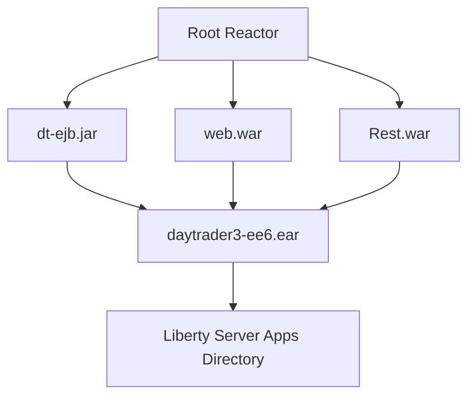
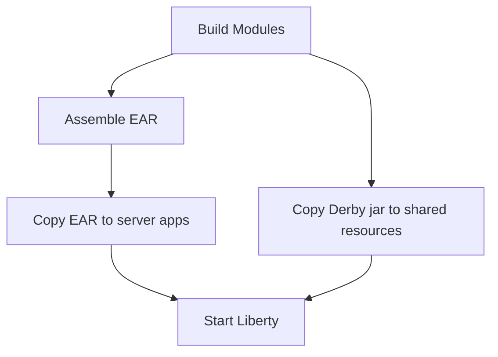
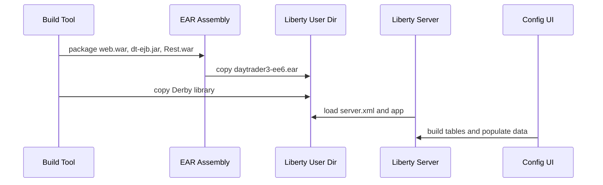

# Chapter 14: Building the EAR and Its Liberty World

Chapter 13 separated REST from the trading domain. Now we step outside application code and look at packaging. In DayTrader, deployment is not an afterthought. The EAR shape, artifact names, Liberty user directory, and copied resources define how all previous chapters become a running system.

Modernization learners often focus on Java classes first and build files last. That is backwards for enterprise modernization. The build tells you what the runtime expects.

By the end, you should understand how the modules become an EAR and how Liberty receives that application.

## Module Packaging

The EAR descriptor maps:

- `web.war` to `/daytrader`.
- `dt-ejb.jar` as the business module.
- `Rest.war` to `/rest`.

Fixed artifact names matter because descriptors and copy tasks expect them. A modernization that renames artifacts must update assembly and server deployment references.

## The Artifact Contract

The EAR descriptor is a contract with exact archive names:

| Archive | EAR Role | Context or Module Meaning |
| --- | --- | --- |
| `web.war` | Web module | Main trading app at `/daytrader` |
| `dt-ejb.jar` | EJB module | Trading services, entities, direct implementation, MDBs |
| `Rest.war` | Web module | Address-book JAX-RS sample at `/rest` |

Those names are not cosmetic. The EAR build maps module artifacts to them, and Liberty deploys the assembled EAR by filename. A modernization that changes artifact names must update the EAR descriptor, build plugin configuration, and server app location together.

## Maven and Gradle Evidence

The repository carries both Maven and Gradle descriptions. Maven appears more complete and central. Gradle mirrors the topology but depends on older conventions and a system Gradle installation.

This duality is common in legacy modernization:

- One build path may be canonical.
- Another may exist for IDEs, experiments, or historical migration.
- The two can drift in dependency scopes or lifecycle behavior.

The REST module already shows a drift risk: JAX-RS API scope differs between Maven and Gradle.

| Concern | Maven Evidence | Gradle Evidence | Modernization Risk |
| --- | --- | --- | --- |
| Module topology | Root reactor lists five modules | `settings.gradle` lists same five modules | Low if kept aligned |
| Archive names | Module POMs and EAR plugin set fixed names | Module builds set archive/base names | Renames can break EAR deployment |
| Liberty integration | EAR module copies EAR and Derby, uses Liberty plugin | Gradle has Liberty tasks and app install tasks | Lifecycle behavior can drift |
| Dependency scope | Provided Java EE APIs in core modules; REST JAX-RS differs | Uses older `providedCompile` style | API duplication or missing runtime APIs |
| Reproducibility | Old plugins may fail on modern Java | No wrapper; old Gradle APIs | Toolchain must be pinned before code work |

## Liberty Copy and Lifecycle Tasks

The EAR module does more than package Java artifacts. It also copies the Derby dependency and the built EAR into the Liberty configuration tree.

That makes the repository partly a source tree and partly a deployable server layout. For training, this is useful because learners see the full runtime. For production, checked-in runtime output is a risk.

## From Build to Running Server

The intended lifecycle is:

1. Build EJB, web, REST, and EAR modules.
2. Copy Derby into Liberty shared resources.
3. Copy `daytrader3-ee6.ear` into the Liberty server `apps` directory.
4. Set `WLP_USER_DIR` to the repository’s Liberty config module.
5. Install the required Liberty feature/package.
6. Start `daytrader3_Sample`.
7. Open `/daytrader`.
8. Use the configuration UI to create tables and populate workload data.
9. Restart before benchmark runs when the setup flow requires it.

This is why build modernization cannot be separated from deployment modernization. The build does not simply produce an artifact; it prepares a local app-server world.

## Old Tooling Risk

The build stack is old. Modern Java runtimes may fail old Maven plugins. Gradle APIs such as `compile` and `providedCompile` point to older Gradle expectations. There is no wrapper to freeze Gradle behavior.

Modernization should treat build revival as a first-class task:

1. Identify the supported JDK range.
2. Make the canonical build reproducible.
3. Add wrapper or containerized build instructions.
4. Update plugins in small, verified steps.
5. Keep artifact names stable until runtime descriptors are updated.

## Training Exercise: Trace an Artifact

Ask an AI agent to trace `web.war` from module source to deployed context root. The expected answer should mention the web module build, EAR assembly, `application.xml`, the EAR copied into the Liberty apps directory, and `/daytrader` as the runtime context. If the answer stops at the WAR file, it has not understood enterprise packaging.

## Apply This

1. **Artifact Name Contract** -> Keeps descriptors and deployment aligned -> Record final archive names before build modernization -> Pitfall: renaming modules and breaking EAR assembly.
2. **Canonical Build Selection** -> Reduces modernization ambiguity -> Pick one build as source of truth, then reconcile the other -> Pitfall: fixing Maven while Gradle silently diverges.
3. **Runtime Copy Awareness** -> Shows build tasks that mutate server layout -> Treat copy tasks as deployment logic -> Pitfall: deleting them as generated-output clutter.
4. **Toolchain Freeze** -> Makes legacy builds repeatable -> Pin JDK, Maven, Gradle, and plugin versions early -> Pitfall: diagnosing code problems caused by tool incompatibility.
5. **EAR Map First** -> Preserves module boundaries -> Read application descriptors before moving classes between modules -> Pitfall: collapsing WAR/EJB roles without replacing container services.
