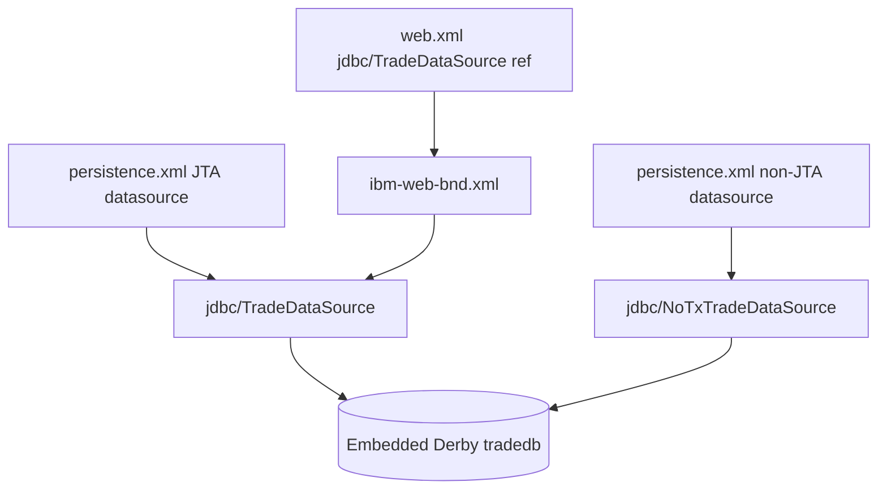
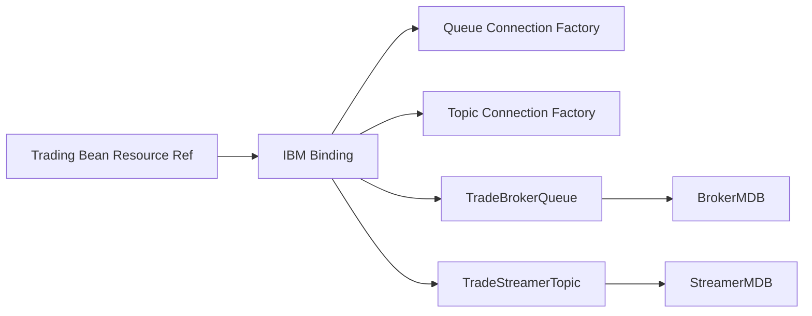

# Chapter 15: Resources, Descriptors, and the Server Contract

Chapter 14 explained how the application is packaged. Packaging gets the code into Liberty; descriptors and server configuration make it run. This chapter covers the server contract: features, datasources, JMS resources, bindings, and legacy descriptors.

Enterprise modernization fails when teams treat server resources as external noise. In DayTrader, JNDI names, connection pools, activation specs, and descriptor bindings are part of the architecture.

By the end, you should be able to connect a resource injection point in Java to the Liberty resource that satisfies it.

## Liberty Features

The server enables the platform capabilities DayTrader needs:

| Feature Family | Why It Exists |
| --- | --- |
| `ejbLite-3.1` | Stateless beans and local invocation |
| `jpa-2.0` | Entity persistence |
| `jmsMdb-3.1` | Message-driven beans |
| `wasJmsServer-1.0` / `wasJmsClient-1.1` | Embedded JMS engine, queues, topics, clients |
| `jsf-2.0` | Facelets primitive |
| `jaxrs-1.1` | REST address-book primitive |

The features tell you which technologies modernization must preserve, replace, or retire.

## JDBC Resources

DayTrader configures two datasources over the same Derby database:

- JTA datasource for transactional application work.
- Non-JTA datasource for non-managed access.

The connection pools have fixed large minimum sizes. That is useful for stable benchmark behavior but questionable for small development machines or cloud-native deployment.

## Resource Resolution Ladder

| Java or Descriptor Source | Binding Layer | `server.xml` Resource | Runtime Behavior |
| --- | --- | --- | --- |
| JPA `jta-data-source` `jdbc/TradeDataSource` | Persistence unit name resolution | `dataSource id="TradeDataSource"` | Transactional Derby access for EJB/JPA |
| JPA `non-jta-data-source` `jdbc/NoTxTradeDataSource` | Persistence unit name resolution | `dataSource id="NoTxTradeDataSource" transactional="false"` | Non-transactional Derby access |
| EJB `jms/QueueConnectionFactory` | `ibm-ejb-jar-bnd.xml` | `jmsQueueConnectionFactory jndiName="jms/TradeBrokerQCF"` | Queue producer for orders |
| EJB `jms/TopicConnectionFactory` | `ibm-ejb-jar-bnd.xml` | `jmsTopicConnectionFactory jndiName="jms/TradeStreamerTCF"` | Topic producer for quote updates |
| EJB `jms/TradeBrokerQueue` | `ibm-ejb-jar-bnd.xml` | `jmsQueue jndiName="jms/TradeBrokerQueue"` | Async order destination |
| EJB `jms/TradeStreamerTopic` | `ibm-ejb-jar-bnd.xml` | `jmsTopic jndiName="jms/TradeStreamerTopic"` | Quote event destination |
| `DTBroker3MDB` | EJB binding activation spec | `jmsActivationSpec id="eis/TradeBrokerMDB"` | Queue delivery to broker MDB |
| `DTStreamer3MDB` | EJB binding activation spec | `jmsActivationSpec id="eis/TradeStreamerMDB"` | Topic delivery to streamer MDB |

This table is the runtime equivalent of a call graph. If any row is broken, Java code can compile and still fail at deployment or first use.

## JMS Resources

The JMS setup includes:

- Messaging engine.
- Broker queue.
- Topic space.
- Queue and topic connection factories.
- Queue and topic destinations.
- Activation specs for MDBs.

Java code refers to resource names. IBM binding descriptors connect those names to Liberty JNDI resources.

This indirection is the server contract. Modernizing to another runtime means replacing that contract explicitly.

## Training Exercise: Trace a Datasource

A good modernization trace for `jdbc/TradeDataSource` should start in `persistence.xml` or `web.xml`, pass through IBM binding where applicable, land in `server.xml`, identify the Derby database path, and explain whether the caller expects JTA behavior. Anything less is a partial infrastructure reading.

## Web and EJB Descriptors

Annotations define many components, but descriptors still matter:

- Web descriptor declares JSF, resource refs, EJB refs, message destination refs, error pages, and session timeout.
- EJB descriptor is mostly empty because annotations own behavior.
- IBM EJB binding maps JMS refs and activation specs.
- IBM web binding maps datasource and JMS refs.
- IBM web extension configures JSP reload behavior and isolation levels.

Legacy Geronimo and JBoss descriptors remain. They are not the Liberty runtime’s primary source of truth, but they document portability history and create reasoning overhead.

## Apply This

1. **Injection-to-JNDI Trace** -> Connects code to runtime resources -> For every `@Resource`, find descriptor and server target -> Pitfall: changing JNDI names in only one layer.
2. **Feature Inventory** -> Defines platform migration scope -> Map enabled server features to actual code paths -> Pitfall: carrying unused platform features forever.
3. **Pool Intent Review** -> Separates benchmark tuning from production tuning -> Document why pool sizes are fixed or large -> Pitfall: copying benchmark pool settings to production.
4. **Descriptor Authority Map** -> Resolves annotation/descriptor overlap -> Decide which file wins for each deployment concern -> Pitfall: editing inactive legacy descriptors.
5. **Activation Spec Preservation** -> Keeps MDB delivery working -> Treat MDB bindings as part of async architecture -> Pitfall: migrating queues without consumer activation.
