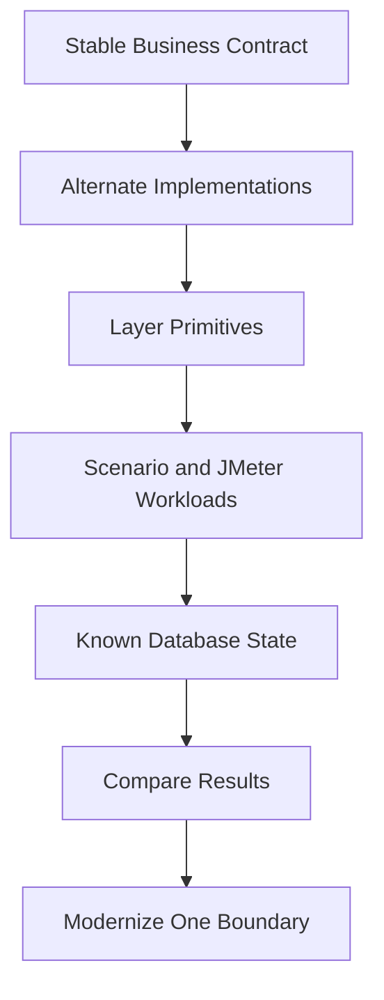

# Chapter 17: Performance Thinking Without Premature Optimization

Chapter 16 showed how DayTrader resets state so workloads are comparable. A modernization can appear faster simply because it skipped quote updates, avoided closed-order alert mutation, used fewer holdings, or ran against a dirty database. That is not a performance win; it is a changed workload.

This chapter extracts the performance method behind the codebase. DayTrader does not optimize blindly. It creates controlled paths, measures adjacent layers, and makes runtime choices explicit.

That is the transferable idea. You do not need Java EE to steal it. Any modernization effort can benefit from stable contracts, alternate implementations, primitive probes, repeatable state, and workload realism.

By the end, you should be able to use DayTrader as a performance training model without copying its legacy APIs.

## The Measurement Method



The method is disciplined:

1. Keep user behavior stable.
2. Provide alternate paths for the same behavior.
3. Build small probes for individual layers.
4. Reset state before measurements.
5. Use realistic and synthetic workloads for different questions.
6. Change one boundary at a time.

## What DayTrader Measures Well

DayTrader is good at measuring specific mechanisms:

| Measurement Target | DayTrader Mechanism |
| --- | --- |
| Servlet/JSP dispatch overhead | Static HTML, simple servlet, include/forward, JSP, JSP EL primitives |
| Session behavior | Session create/read, invalidate churn, large session payload primitives |
| JNDI and datasource access | JNDI lookup and JDBC connection primitives |
| Direct JDBC vs EJB/JPA | Runtime modes behind `TradeServices` |
| EJB invocation and transactions | Session bean primitives and session-to-direct mode |
| JMS send and MDB delivery | Queue/topic pings and async order completion |
| JSF and REST stack presence | Facelets primitives and address-book JAX-RS WAR |
| Cache sensitivity | Market-summary interval and long-run mode |

It is less good at measuring:

- Real financial correctness.
- Modern browser frontend behavior.
- Production security.
- Distributed databases.
- Real market-data streaming.
- Cloud-native deployment concerns.

Knowing the limits is part of performance engineering.

## Avoiding False Confidence

Performance tests lie when state drifts, workloads change, or endpoints do different work.

DayTrader includes several controls:

- Reset stats.
- Workload mix configuration.
- Primitive iterations.
- Long-run mode.
- Market-summary interval.
- JMeter assertions and cookies.

It also includes pitfalls:

- Scenario servlet throughput is not browser throughput.
- Static counters are approximate.
- Direct and JPA implementations can drift.
- Primitive endpoints may include stale labels or questionable resource cleanup.

## Modernization Performance Loop

Use DayTrader modernization as a loop:

```java
baseline = measure(currentSystem, workload)
change = modernizeOneBoundary()
candidate = measure(change, sameWorkload)

if behaviorDiffers(candidate):
    fixCorrectness()
else:
    comparePerformance(baseline, candidate)
```

Correctness comes before speed. The stable service contract and workloads make that possible.

## Worked Example: Modernize Persistence Only

Suppose the training task is to replace JPA entity access with a modern repository layer. A valid before/after run holds these constant:

- Same database size after reset.
- Same runtime mode target or clearly defined replacement mode.
- Same order processing mode.
- Same market summary interval.
- Same workload mix.
- Same JMeter script and thread/duration settings.
- Same visible trading invariants from Chapter 5.

The candidate is not accepted because it is faster. It is accepted only if it preserves login counters, buy/sell balances, holdings, order alerts, quote movement, and workload assertions, then improves or intentionally changes measured performance.

## Training Exercise: Design a Fair Run

Ask an AI agent to propose a benchmark plan for “modernize persistence only.” The expected answer should name fixed variables, reset procedure, workloads, invariants, and rollback criteria. If it only says “run JMeter before and after,” it has not learned the DayTrader method.

## Apply This

1. **One-Boundary Change** -> Keeps performance deltas explainable -> Modernize one layer at a time -> Pitfall: changing UI, persistence, and deployment together.
2. **Synthetic and Real Workloads** -> Answers different questions -> Use primitives for layer cost and JMeter for user behavior -> Pitfall: treating one workload as universal truth.
3. **State Reset Discipline** -> Makes runs comparable -> Reset and verify counts before measurements -> Pitfall: comparing against warmed, dirty, or differently populated databases.
4. **Correctness-Before-Speed Gate** -> Prevents fast regressions -> Check behavior before accepting performance gains -> Pitfall: celebrating speedups from removed side effects.
5. **Measurement Scope Statement** -> Clarifies what a benchmark proves -> Document what each test includes and excludes -> Pitfall: extrapolating Java EE primitive results to unrelated architectures.
