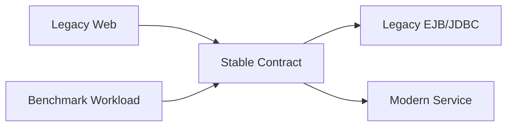

# Chapter 18: Modernization Patterns You Can Reuse

Chapter 17 extracted the performance method. This final chapter synthesizes the modernization lessons. DayTrader is old Java EE, but the patterns are not old. The useful ideas are about boundaries, behavior, comparability, and careful replacement.

The goal is not to preserve DayTrader forever. The goal is to modernize it without losing the knowledge embedded in its architecture.

By the end, you should have a practical modernization playbook for this codebase and for similar legacy enterprise systems.

## Pattern 1: Build a Domain Invariant Map

Before changing code, write down invariants:

- Login updates counters.
- Buy debits balance immediately.
- Sell credits balance immediately.
- Buy completion creates holding.
- Sell completion removes holding.
- Closed orders become completed when alerted.
- Quote updates follow trades.
- Reset creates a known workload world.

These invariants are more important than class names.

## Pattern 2: Preserve Comparable Surfaces

`TradeServices` is the modernization anchor. Keep it stable while replacing internals. Add adapters around new services if needed.

This lets learners compare behavior before and after modernization.

## Pattern 3: Split Product Code from Measurement Code

Do not delete benchmark scaffolding blindly. Label it:

| Category | Examples | Modernization Action |
| --- | --- | --- |
| Product trading behavior | buy, sell, portfolio, account | Preserve and test first |
| Measurement primitives | Ping servlets, JSF pings, REST address sample | Preserve if training benchmark needs them |
| Operations | reset, build DB, config | Secure, externalize, or remove from production |
| Historical residue | legacy descriptors, stale comments | Verify then prune |

## Pattern 4: Replace Runtime Wiring Explicitly

JNDI names, descriptors, datasources, queues, and activation specs are architectural contracts. A modern runtime still needs equivalents:

- Database connection config.
- Transaction boundary.
- Queue/topic names.
- Message consumers.
- Deployment environment.
- Configuration source.

Do not let framework migration hide these decisions.

## Pattern 5: Use AI as a Trace Assistant, Not a Guessing Engine

This codebase is ideal for AI-assisted modernization because tasks can be scoped by behavior:

- “Trace buy across all implementations.”
- “List every place order status changes.”
- “Compare JPA and direct JDBC market summary behavior.”
- “Find all request attributes required by portfolio JSP.”
- “Identify deployment resources required by async order completion.”

Those prompts force evidence. Broad prompts invite shallow rewrites.

## A Modernization Decision Table

| Phase | Evidence Required | Allowed Changes | Rollback Criteria |
| --- | --- | --- | --- |
| Understand | Workflow traces, invariant table, resource map | Documentation and tests only | Missing behavior path |
| Stabilize | Reproducible build, reset procedure, smoke workload | Build/tooling fixes that preserve artifacts | Artifact name or runtime drift |
| Isolate | `TradeServices` contract tests across modes | Adapters and characterization tests | EJB/JDBC behavior mismatch |
| Replace UI | Request attribute map and workload compatibility | New views/controllers behind same behavior | Scenario/JMeter breakage |
| Replace Persistence | Schema map and state-transition tests | Repository/service internals | Balance/order/holding/quote invariant failure |
| Replace Messaging | Queue/topic contract and redelivery policy | Messaging adapter or broker migration | Lost async completion or duplicate semantics |

The exact order can change, but the principle should not: understand, stabilize, then replace.

## Pattern 6: Runtime Strategy Switches

DayTrader’s runtime modes are a modernization gift. They let you compare implementations without changing the user workflow. Keep that idea even if you replace static config with dependency injection or environment-driven routing.

The rule is simple: runtime switches should be explicit, observable, and testable. Hidden framework selection makes benchmark interpretation harder.

## Pattern 7: Transaction-Boundary Experiments

`SESSION3`, direct async two-phase, `REQUIRES_NEW` quote publication, and `NOT_SUPPORTED` reset are all transaction-boundary experiments. They show how behavior changes when the owner of commit/rollback moves.

When modernizing, preserve the experiment long enough to answer what the old boundary did. Then decide whether the target system still needs that boundary.

## Pattern 8: Instrumentation Endpoints

Primitive endpoints are executable documentation of platform cost. They are not production features, but they are valuable training tools. If you remove them, replace them with another measurement harness instead of leaving the system blind.

## What Not to Copy

Do not copy these into production without redesign:

- Unauthenticated reset/config endpoints.
- Password handling as plain profile fields.
- Mutable static runtime config.
- JSP scriptlets and service calls in views.
- Sentinel timestamps as status.
- Checked-in runtime logs and stores.
- Ignoring redelivered messages.
- Multiple drifting descriptors.

The point of DayTrader is not that every pattern is good. The point is that every pattern teaches something.

## Final Synthesis

DayTrader’s architectural bet is powerful: keep one trading contract stable while driving it through many runtime paths. That makes the system useful for performance comparison and modernization training. The trading app gives the benchmark real shape. The benchmark scaffolding gives the trading app diagnostic value.

The modernization lesson is equally direct: preserve behavior before replacing mechanisms. Once the invariants are visible, you can move from JSP to modern UI, from EJB to services, from direct JDBC to repositories, from Liberty descriptors to platform configuration, and from in-app reset to automated migrations. But if you skip the tracing step, the code will let you make changes that look clean and are wrong.

## Apply This

1. **Invariant-First Modernization** -> Protects business behavior across rewrites -> Capture domain rules before selecting frameworks -> Pitfall: modernizing syntax while changing semantics.
2. **Adapter-Led Replacement** -> Allows old and new paths to coexist -> Put modern services behind the existing contract first -> Pitfall: forcing all callers to migrate at once.
3. **Benchmark Preservation Choice** -> Makes measurement scope intentional -> Decide which primitives remain in the training system -> Pitfall: accidentally deleting diagnostic coverage.
4. **Runtime Contract Migration** -> Carries infrastructure behavior forward -> Map every datasource, queue, and binding to a target equivalent -> Pitfall: treating deployment config as environment trivia.
5. **Evidence-Based AI Prompts** -> Makes AI useful on legacy code -> Ask for traces, comparisons, and invariants with file evidence -> Pitfall: asking for broad rewrites before the system is understood.
